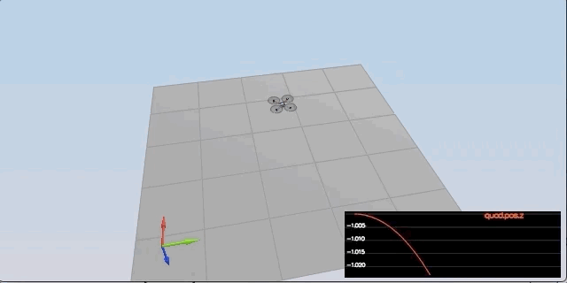
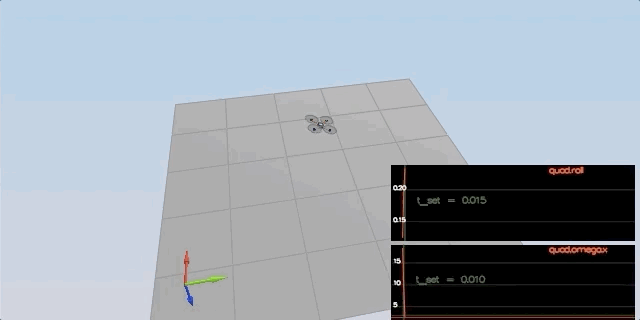
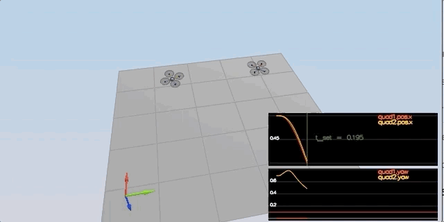

# The Controller for a 3D Quadrotor in C++ Project Readme #

This is the readme for the C++ project.

For easy navigation throughout this document, here is an outline:

 - [Development environment setup](#development-environment-setup)
 - [Simulator walkthrough](#simulator-walkthrough)
 - [The tasks](#the-tasks)
 - [Evaluation](#evaluation)


## Development Environment Setup ##

Regardless of your development platform, the first step is to download or clone this repository.

Once you have the code for the simulator, you will need to install the necessary compiler and IDE necessary for running the simulator.

Here are the setup and install instructions for each of the recommended IDEs for each different OS options:

### Windows ###

For Windows, the recommended IDE is Visual Studio.  Here are the steps required for getting the project up and running using Visual Studio.

1. Download and install [Visual Studio](https://www.visualstudio.com/vs/community/)
2. Select *Open Project / Solution* and open `<simulator>/project/Simulator.sln`
3. From the *Project* menu, select the *Retarget solution* option and select the Windows SDK that is installed on your computer (this should have been installed when installing Visual Studio or upon opening of the project).
4. Make sure platform matches the flavor of Windows you are using (x86 or x64). The platform is visible next to the green play button in the Visual Studio toolbar:


5. To compile and run the project / simulator, simply click on the green play button at the top of the screen.  When you run the simulator, you should see a single quadcopter, falling down.


### OS X ###

For Mac OS X, the recommended IDE is XCode, which you can get via the App Store.

1. Download and install XCode from the App Store if you don't already have it installed.
2. Open the project from the `<simulator>/project` directory.
3. After opening project, you need to set the working directory:
  1. Go to *(Project Name)* | *Edit Scheme*
  2. In new window, under *Run/Debug* on left side, under the *Options* tab, set Working Directory to `$PROJECT_DIR` and check ‘use custom working directory’.
  3. Compile and run the project. You should see a single quadcopter, falling down.


### Linux ###

For Linux, the recommended IDE is QtCreator.

1. Download and install QtCreator.
2. Open the `.pro` file from the `<simulator>/project` directory.
3. Compile and run the project (using the tab `Build` select the `qmake` option.  You should see a single quadcopter, falling down.

**NOTE:** You may need to install the GLUT libs using `sudo apt-get install freeglut3-dev`


### Advanced Versions ###

These are some more advanced setup instructions for those of you who prefer to use a different IDE or build the code manually.  Note that these instructions do assume a certain level of familiarity with the approach and are not as detailed as the instructions above.

#### CLion IDE ####

For those of you who are using the CLion IDE for developement on your platform, we have included the necessary `CMakeLists.txt` file needed to build the simulation.

#### CMake on Linux ####

For those of you interested in doing manual builds using `cmake`, we have provided a `CMakeLists.txt` file with the necessary configuration.

**NOTE: This has only been tested on Ubuntu 16.04, however, these instructions should work for most linux versions.  Also note that these instructions assume knowledge of `cmake` and the required `cmake` dependencies are installed.**

1. Create a new directory for the build files:

```sh
cd FCND-Controls-CPP
mkdir build
```

2. Navigate to the build directory and run `cmake` and then compile and build the code:

```sh
cd build
cmake ..
make
```

3. You should now be able to run the simulator with `./CPPSim` and you should see a single quadcopter, falling down.

## Simulator Walkthrough ##

Now that you have all the code on your computer and the simulator running, let's walk through some of the elements of the code and the simulator itself.

### The Code ###

For the project, the majority of your code will be written in `src/QuadControl.cpp`.  This file contains all of the code for the controller that you will be developing.

All the configuration files for your controller and the vehicle are in the `config` directory.  For example, for all your control gains and other desired tuning parameters, there is a config file called `QuadControlParams.txt` set up for you.  An import note is that while the simulator is running, you can edit this file in real time and see the affects your changes have on the quad!

The syntax of the config files is as follows:

 - `[Quad]` begins a parameter namespace.  Any variable written afterwards becomes `Quad.<variablename>` in the source code.
 - If not in a namespace, you can also write `Quad.<variablename>` directly.
 - `[Quad1 : Quad]` means that the `Quad1` namespace is created with a copy of all the variables of `Quad`.  You can then overwrite those variables by specifying new values (e.g. `Quad1.Mass` to override the copied `Quad.Mass`).  This is convenient for having default values.

You will also be using the simulator to fly some difference trajectories to test out the performance of your C++ implementation of your controller. These trajectories, along with supporting code, are found in the `traj` directory of the repo.


### The Simulator ###

In the simulator window itself, you can right click the window to select between a set of different scenarios that are designed to test the different parts of your controller.

The simulation (including visualization) is implemented in a single thread.  This is so that you can safely breakpoint code at any point and debug, without affecting any part of the simulation.

Due to deterministic timing and careful control over how the pseudo-random number generators are initialized and used, the simulation should be exactly repeatable. This means that any simulation with the same configuration should be exactly identical when run repeatedly or on different machines.

Vehicles are created and graphs are reset whenever a scenario is loaded. When a scenario is reset (due to an end condition such as time or user pressing the ‘R’ key), the config files are all re-read and state of the simulation/vehicles/graphs is reset -- however the number/name of vehicles and displayed graphs are left untouched.

When the simulation is running, you can use the arrow keys on your keyboard to impact forces on your drone to see how your controller reacts to outside forces being applied.

#### Keyboard / Mouse Controls ####

There are a handful of keyboard / mouse commands to help with the simulator itself, including applying external forces on your drone to see how your controllers reacts!

 - Left drag - rotate
 - X + left drag - pan
 - Z + left drag - zoom
 - arrow keys - apply external force
 - C - clear all graphs
 - R - reset simulation
 - Space - pause simulation


### Testing it Out ###

When we run the simulator, we noticed that our quad is falling straight down.  This is due to the fact that the thrusts are simply being set to:

```
QuadControlParams.Mass * 9.81 / 4
```

Therefore, if the mass doesn't match the actual mass of the quad, it'll fall down.  We tuned the `Mass` parameter in `QuadControlParams.txt` to 0.5 to make the vehicle more or less stay in the same spot.

### Scenario 1_Intro.

With the proper mass, your simulation should look a little like this:

<p align="center">

</p>


## The Tasks ##

For this project, we will be building a controller in C++.  We will be implementing and tuning this controller in several steps.

### Body rate and roll/pitch control (scenario 2) ###

First, we implemented the body rate and roll / pitch control.  For the simulation, we will use `Scenario 2`.  In this scenario, we can see a quad above the origin.  It is created with a small initial rotation speed about its roll axis.  Our controller stabilizes the rotational motion and bring the vehicle back to level attitude.

To accomplish this, we:

1. Implemented body rate control

 - implemented the code in the function `GenerateMotorCommands()` Line 72-81
 
```c++
    V3F thrustDiff;
    
    thrustDiff.x = momentCmd.x / (L / sqrtf(2.f));
    thrustDiff.y = momentCmd.y / (L / sqrtf(2.f));
    thrustDiff.z = momentCmd.z / (kappa);
    
    cmd.desiredThrustsN[0] = (collThrustCmd + thrustDiff.x + thrustDiff.y - thrustDiff.z)/ 4.f; // front left
    cmd.desiredThrustsN[1] = (collThrustCmd - thrustDiff.x + thrustDiff.y + thrustDiff.z)/ 4.f; // front right
    cmd.desiredThrustsN[2] = (collThrustCmd + thrustDiff.x - thrustDiff.y + thrustDiff.z)/ 4.f; // rear left
    cmd.desiredThrustsN[3] = (collThrustCmd - thrustDiff.x - thrustDiff.y - thrustDiff.z)/ 4.f; // rear right

```

 - implemented the code in the function `BodyRateControl()` Line 107
 ```c++
momentCmd = V3F(Ixx,Iyy,Izz) * kpPQR * (pqrCmd-pqr);
 ```
 - Tune `kpPQR` to `= 92, 92` in `QuadControlParams.txt` to get the vehicle to stop spinning quickly but not overshoot

I can see the rotation of the vehicle about roll (omega.x) get controlled to 0 while other rates remain zero.  Note that the vehicle will keep flying off quite quickly, since the angle is not yet being controlled back to 0.  Also note that some overshoot will happen due to motor dynamics!.

2. Implement roll / pitch control
We won't be worrying about yaw just yet.

 - implement the code in the function `RollPitchControl()` Line 137-154
 
```c++
    float TiltAngle_x = 0;
    float TiltAngle_y = 0;
    if (collThrustCmd > 0)
    {
        TiltAngle_x = accelCmd.x / (-collThrustCmd / mass);
        TiltAngle_y = accelCmd.y / (-collThrustCmd / mass);
        TiltAngle_x = CONSTRAIN(TiltAngle_x, -(maxTiltAngle), (maxTiltAngle));
        TiltAngle_y = CONSTRAIN(TiltAngle_y, -(maxTiltAngle), (maxTiltAngle));
        pqrCmd.x = (R(1, 0) * kpBank*(TiltAngle_x - R(0, 2)) - R(0, 0) * kpBank*(TiltAngle_y - R(1, 2)))/R(2,2);
        pqrCmd.y = (R(1, 1) * kpBank*(TiltAngle_x - R(0, 2)) - R(0, 1) * kpBank*(TiltAngle_y - R(1, 2)))/R(2,2);
    }
    else{
        pqrCmd.x = 0;
        pqrCmd.y = 0;
    }
    

    pqrCmd.z = 0;

```

 - Tune `kpBank = 15` in `QuadControlParams.txt` to minimize settling time but avoid too much overshoot

I can see the quad levels and the vehicle angle (Roll) get controlled to 0.

<p align="center">

</p>


### Position/velocity and yaw angle control (scenario 3) ###

Next, I implemented the position, altitude and yaw control for our quad.  For the simulation, I will use `Scenario 3`.  This will create 2 identical quads, one offset from its target point (but initialized with yaw = 0) and second offset from target point but yaw = 45 degrees.

 - implement the code in the function `LateralPositionControl()` Line 226-240
 
```c++
    V3F capVelCmd;
    if (velCmd.mag() > maxSpeedXY)
    {
        capVelCmd = velCmd.norm() * maxSpeedXY;
    }
    else
    {
        capVelCmd = velCmd;
    }
    
    accelCmd += kpVelZ * (capVelCmd - vel) + kpPosZ * (posCmd - pos);
    
    if (accelCmd.mag() > maxAccelXY ){
        accelCmd = accelCmd.norm() * maxAccelXY;
    }

```
 - implement the code in the function `AltitudeControl()` Line 182-191
 
```c++
    integratedAltitudeError = integratedAltitudeError + (posZCmd - posZ) * dt;
    
    float p_t = kpPosZ * (posZCmd - posZ);
    float d_t = kpVelZ * (velZCmd - velZ) + velZ;
    float i_t = KiPosZ * integratedAltitudeError;
    
    float accel = (p_t + i_t + d_t + accelZCmd - 9.81f)/R(2,2);
    

    return (-mass* CONSTRAIN(accel, - maxAscentRate / dt, maxAscentRate / dt));

```
 
 - tuned parameters `kpPosZ` and `kpPosZ`
 - tuned parameters `kpVelXY` and `kpVelZ`

```

# Position control gains
kpPosXY = 30
kpPosZ = 20
KiPosZ = 40

# Velocity control gains
kpVelXY = 11.5
kpVelZ = 9.5

```

If successful, the quads should be going to their destination points and tracking error should be going down (as shown below). However, one quad remains rotated in yaw.

 - implement the code in the function `YawControl()`  Line 263-273
 
```c++
    float err = yawCmd - yaw;
    err = fmodf(err, F_PI*2.f);
    if (err > F_PI)
    {
        err -= 2.f * F_PI;
    }
    else if (err < -F_PI)
    {
        err += 2.f * F_PI;
    }
    yawRateCmd = err * kpYaw;

```

 
 - tuned parameters `kpYaw=3` and the 3rd (z) component of `kpPQR` to `6`

<p align="center">

</p>

### Non-idealities and robustness (scenario 4) ###

In this part, we will explore some of the non-idealities and robustness of a controller.  For this simulation, we will use `Scenario 4`.  This is a configuration with 3 quads that are all are trying to move one meter forward.  However, this time, these quads are all a bit different:
 - The green quad has its center of mass shifted back
 - The orange vehicle is an ideal quad
 - The red vehicle is heavier than usual

<p align="center">

</p>


### Tracking trajectories ###

Now that we have all the working parts of a controller, we put it all together and test it's performance once again on a trajectory.  For this simulation, you will use `Scenario 5`.  
<p align="center">

</p>


## Authors ##

Thanks to Fotokite for the initial development of the project code and simulator.